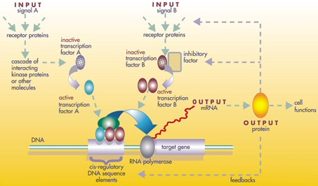
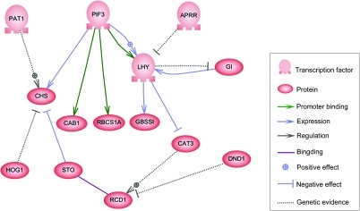
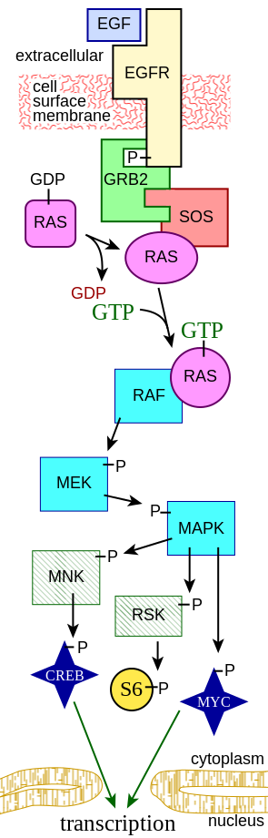
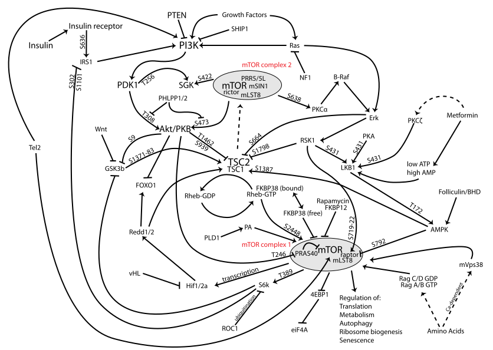

# Hackathon 2018

# Background..

# Data sets

We have two collections of data sets, one for melanoma tumors and one for lung cancer 
tumors. We will focus our efforts on the melanoma tumors. Although we will 
produce melanoma-specific results, the underlying methods should be equally applicable to the 
lung cancer data set as the data schema's are identical.

# Targets

First we need get a picture of what a "signature" actually means in this context. We basically have hierarchically dependent data with "pathways" going through those layers, those pathways are connected by mutations on the one end (DNA) and proteins on the other end. How to find those pathways is the main question, because once we can do that, we only have to identify either which pathways are typical for people that do or do not respond well to immunotherapy, or what part of the pathway is typically different for those patients.

So what is a pathway? A pathway is a chain of molecular changes that leads to, in our case, the production of certain proteines, 
or (since we don't have many proteomic measurements) certain RNA codes. In the simplest form it is a sequence, but it 
is more likely similar to a bi-directed graph, in it's simplest form; DNA mutation <--> RNA <--> mRNA <--> proteines.
The collection of molecular regulators that govern the genomic expression levels of mRNA and proteins is called the 
[gene regulatory network (GRN)](https://en.wikipedia.org/wiki/Gene_regulatory_network). So, instead of chain, it is better
to say a network of molecular changes.

Specifically, given that we find a pathway, the genomes that, given a mutation, will lead to a proto-oncogenic or an inhibiting effect on tumor development
are denoted as proto-oncogenics and inhibitors, the former promotes tumor growth, the latter slows it down.

One such pathway is the Mitogen Activated Protein Kinase (MAPK) pathway. This pathway connects certain mutations of the
[BRAF](https://en.wikipedia.org/wiki/BRAF_(gene)) oncogene (i.e. DNA) to the generation of certain proteins that lead to the promotion of cell growth. This 
[MAPK pathway](https://en.wikipedia.org/wiki/MAPK/ERK_pathway) looks as follows:

Just to show the complexity, the [PI3K/AKT/mTOR pathway](https://en.wikipedia.org/wiki/PI3K/AKT/mTOR_pathway) looks as follows:

Don't worry, this is not expected from us..although I can produce this stuff in paint, hands down (I can actually use my 
nose to draw..). Anyways, back to reality: we only have a few thousand protein measurements, and we do not have any
time series data so it is practically impossible to extract any feedback effects from downstream changes. 
Ooofff, that leaves us with a top down approach, from instruction/mutation to RNA and in some cases, proteins.
Finding any feedback effect is secondary, and perhaps for continued work after the hackathon.

Now, given such a pathway we can frustrate the signal anywhere on the chain, as long as it prevents
the cell growth stimulation.

We should keep in mind that the inhibitors/proto-oncogenes are likely specific to
the type of melanoma's, we distinguish at least the following by their genomic mutations:
* (proto-oncogenes) BRAF wild-type
* Triple Wild-type
* NF1 
* KIT
* MITF
* RAS
* (inhibitor) PD-1/PD-L1

The current inhibitor, the one they likely use in the immunotherapy is PD-L1. It is called a checkpoint inhibitor, retrieving this 
from our models would be a good validator.

"Official" supporting questions:
* Can you show and visualize the correlations and concepts between the different datasets?
* As melanoma is a set of diverse diseases, can you stratify the patients based on all the data in to subgroups?
* Can you integrate all the data to make more accurate predictions for each patient than you would by only looking at one data source?
* Can you select a list of most informational variables that drive the predictions?
* Can you select a list of most informational variables distinctive for each patient subgroup?
* Can you identify a signature based on an integrative approach that can predict response to immunotherapy?
* Can you identify a signature that correlates with the prognosis of immunotherapy?

Basic hypotheses that would be nice to confirm
* T(tumor), increased Bresow-thickness correlates with more malignancy (Tis, T1a/b, T2a/b, T3a/b, T4a/b), i.e. decreasing survival rate
* N(nodal stage), Local spread correlates with more malignancy (N0, N1a/b, N2a/b/c, N3)
* M(metastasis location), distant metastasis (beyond regional lymph nodes)  corresponds with mmore malignancy (M0, M1)
* BRAF proto-oncogenic mutations should occcur in about 50% of all cutaneous melanomas.

# Things biologists like

Hierarchical cluster diagrams, linked graphs, flow diagrams and simple tables/heatmaps with 
the most important genomes. 

# Reference results

* We should be able to identify 4 subtypes of cutaneous melanomas: BRAS/RAS(N/H/K)/NF1/Triple-WT
* order 3 clusters in the mRNA profiles of the most variant genes (keratin, immune, MITF-low)
* inhibitor: PD-L1/PD-1, our method should be able to retrieve this specific mutation as an inhibitor
* inhibitor: MEK, our method should be able to retrieve this specific mutation as an inhibitor for BRAF wild-type/NF1 mutant melanoma's
* inhibitor: PTEN/TP53/APC, our method should be able to retrieve this specific mutation as an inhibitor
* proto-oncogenic: BRAF, our method should be able to retrieve this specific mutation as a proto-oncogene
* LCK protein expression: correlates positively with patient survival

# Suggested approaches 

Please add ideas with your name in the section header.

## Classifications per layer 

This should be easy to do. First we should define the targets that are relevant to our end goal,
which is to recognize pathways, and inhibitors on those pathways. I.e. we need to be able to 
predict the level of malignancy, the survival rate and the response to immunotherapy.

This generates weights/importances per feature and gives the predictive power of each layer. 

## Correlations between different layers, 

layer pairs: DNA-RNA, RNA-mRNa, mRNa-proteomics, using 
* raw features
* raw, filtered features (using variance over the different classes)
* reduced features per layer (PCA/LDA whatever)

-> generate new cross-layers that combine all possible layer pairs into single layer,
train classifier and characterise the multilayer pairs.

I.e. Correlated features link the layers pairwise, after which the layers can be connected into 
a single layer. 

## Clusters per layer

## Bayesian Networks

Given potential pathways we can infer Bayesian Networks as approximations for the GRN and visualize them
with some graph viz. tool. 

# Sources

https://www.ncbi.nlm.nih.gov/pmc/articles/PMC4731297/
https://www.ncbi.nlm.nih.gov/pmc/articles/PMC5496318/#MOESM8

https://www.nature.com/articles/nature13385

https://www.ncbi.nlm.nih.gov/pubmed/26091043
https://www.ncbi.nlm.nih.gov/pubmed/22960745